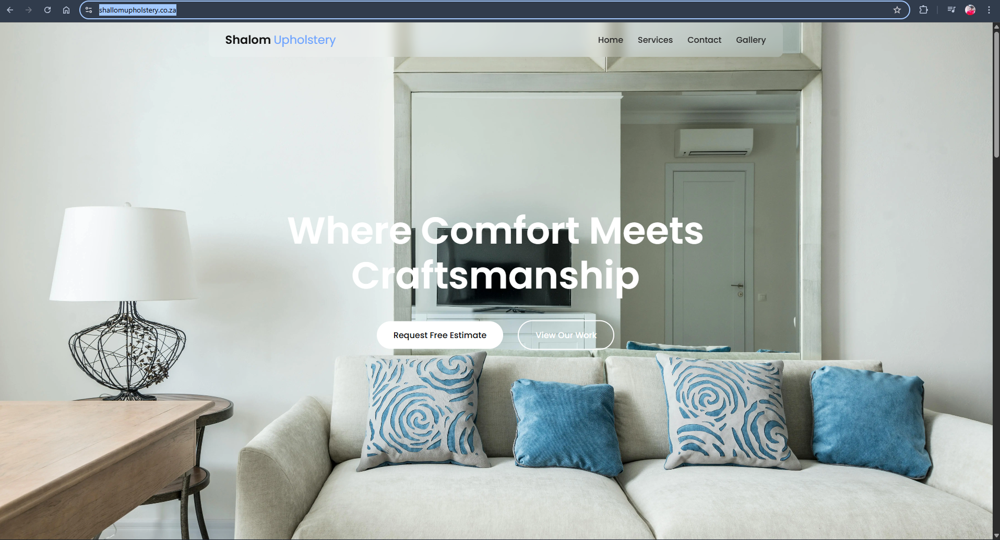
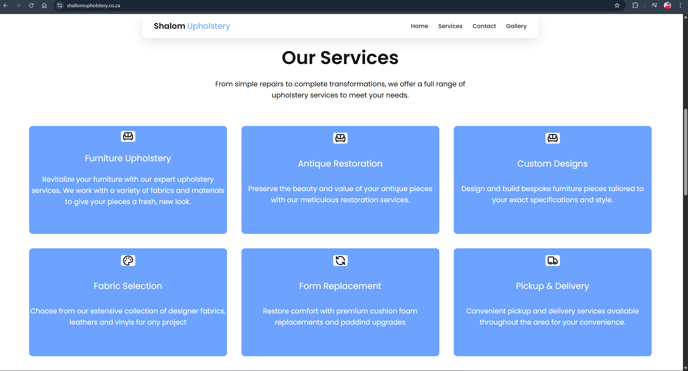
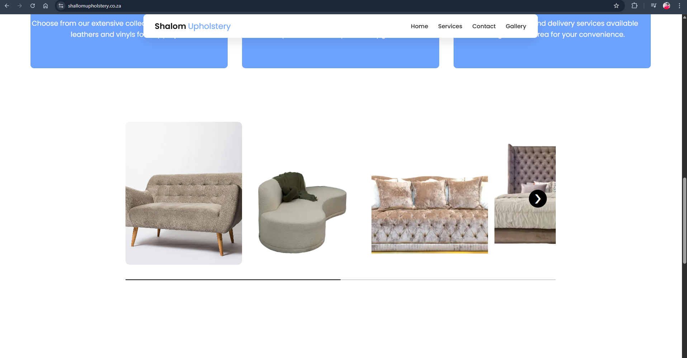
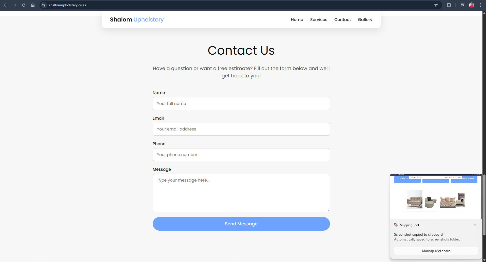

# Shalom Upholstery – Business Website

🔗 **Live Website:** https://shallomupholstery.co.za/  

## 📌 Project Overview
Shalom Upholstery is a professional business website built to showcase upholstery services, improve online presence, and allow customers to easily get in touch.

## 🎯 Purpose
- Increase brand visibility
- Display services and previous work
- Enable customer inquiries

## 🛠️ Technologies Used
- HTML5
- CSS3
- JavaScript
- Responsive Design

## 🌍 Features
- Modern responsive layout
- Service sections
- Contact information
- Fast-loading static pages

## 📸 Screenshots

## 🚀 Deployment
The website is deployed using professional hosting and a custom domain.

## 🔒 Source Code
The source code is private to protect client intellectual property.

